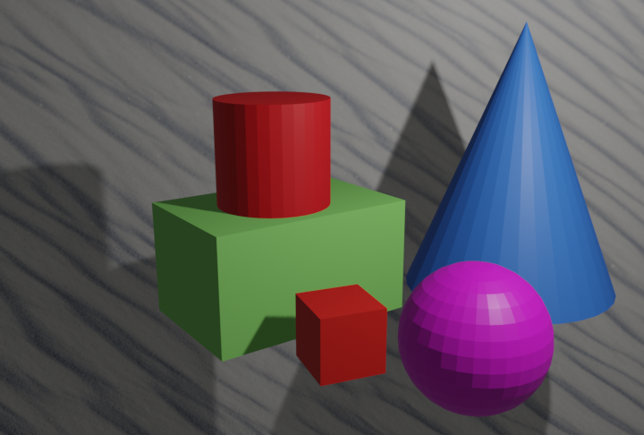
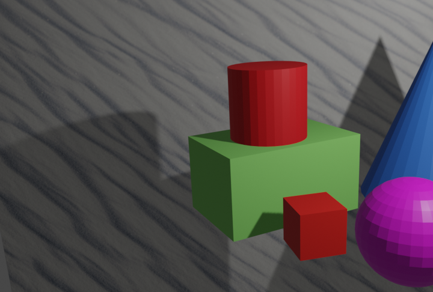
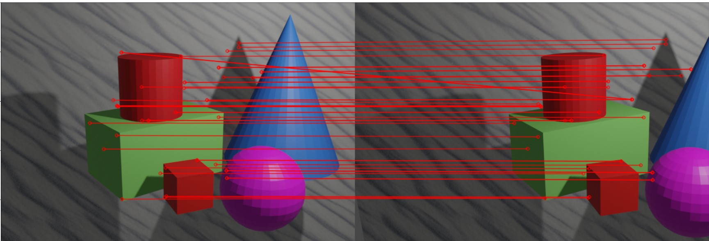
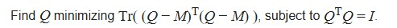
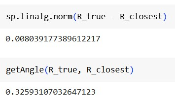

# Camera rotation matrix estimation between two consecutive frames for the case of pure rotation (no camera transaltion between two frames)

 \
This repository demonstrates one of the approaches for estimating rotation between two frames, which can be useful for the variety of tasks such as: visual odometry, structure from motion, etc.

1. Using Blender script we generated synthetic data: two frames obtained by rotating camera around vertical axis of the Camera Frame. The true rotation matrix and camera matrix are known as well.

2. To estimate the homography matrix we found key points and their descriptors using SIFT. To match the key points the ratio test has been applied.

3. From the known homography the rotation matrix can be estimated as follows:
*R_rec = inv(K) H K*. However, in most cases R_rec is not even going to be a rotation matrix (e.g. det(R_rec) might be no equal 1).

4. Finding the closest rotation matrix R_closest to the R_rec by formulating the optimization problem of the type:
 \
 This optimization problem can be solved using [Polar Decomposition](https://en.wikipedia.org/wiki/Rotation_matrix), which in itself can be found using [SVD](https://en.wikipedia.org/wiki/Polar_decomposition)
 
**Results**\
Comparison of the known true rotation matrix and estimated one has been done in two ways: by Frobenius norm, and by angle in degrees between two matrices. The results are quite good for such a simple approach.\

