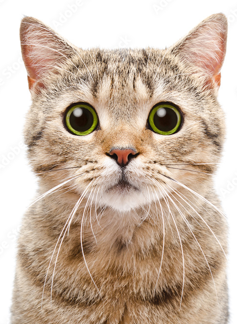
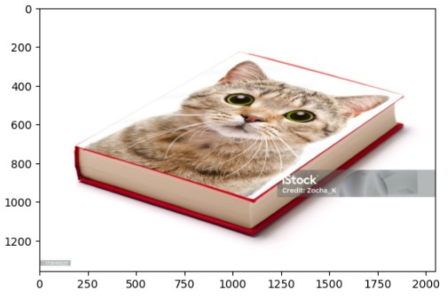

# Homography transform to change image perspective.

This project demostrates the use of [homography matrix](https://en.wikipedia.org/wiki/Homography_(computer_vision)) to change perspective of one image in order to merge it with another one. 
To accomplish this the following steps need to be implemented: 
1. Find homography matrix between 4 corresponding points (corner points of the image with a cat and the book's corners). It's done in 3 different ways: using the standard OpenCV function *cv.findHomography()*, SVD decomposition and eigenvalues problem.

2. Wrap the image with a cat utilizing homography matrix and OpenCV function *warpPerspective()*
3. Merge two images together

**Original images**

**Result**

