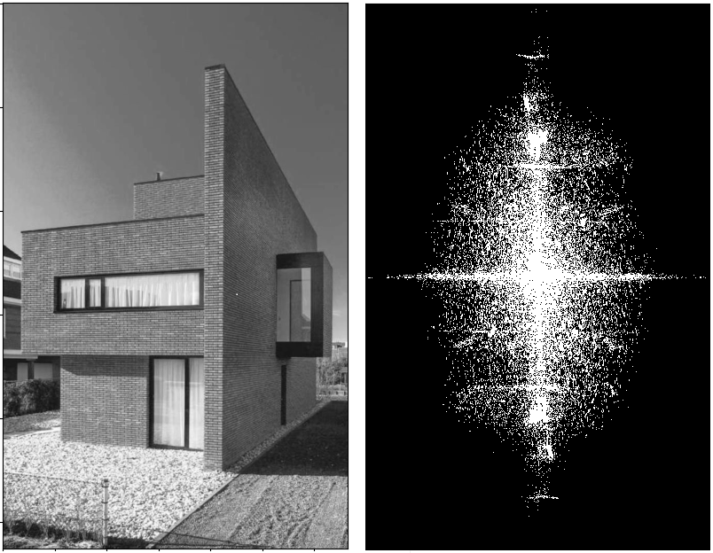
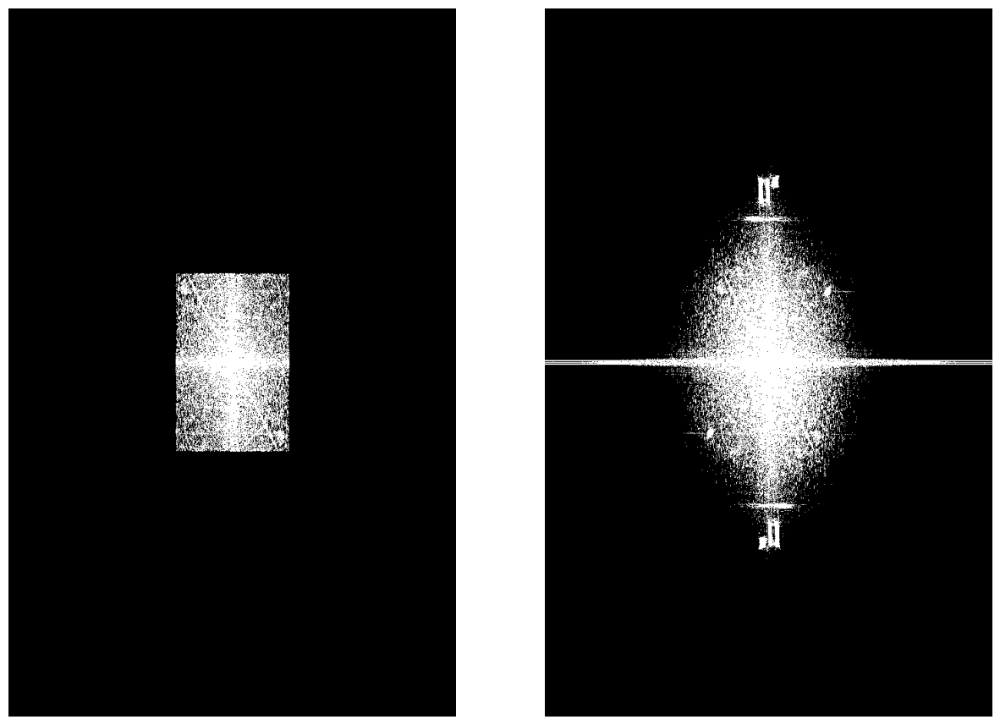
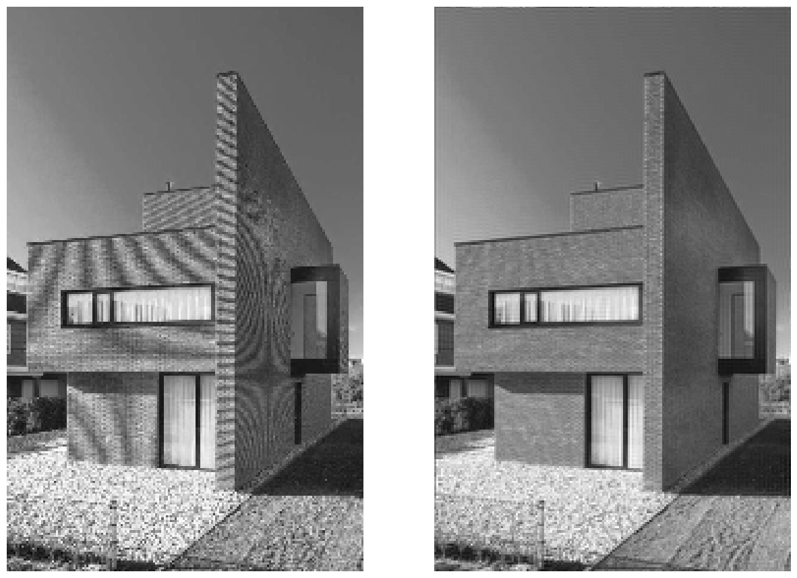
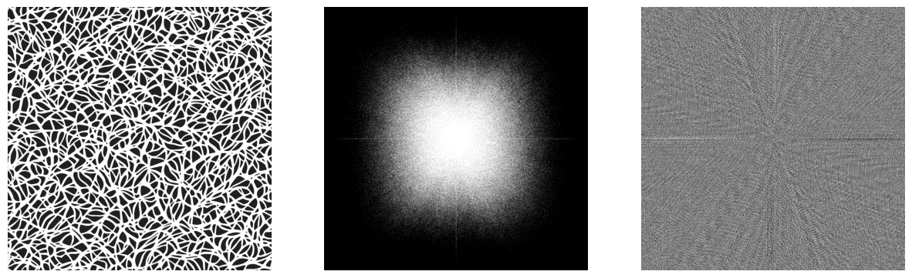
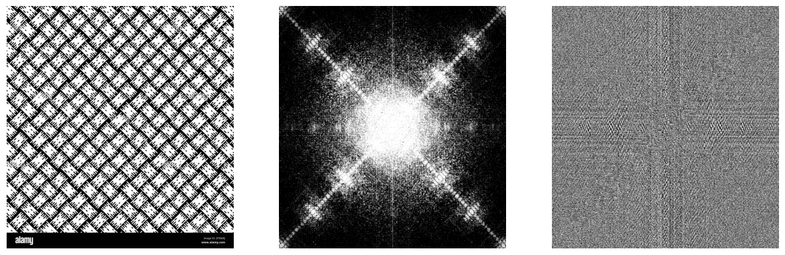
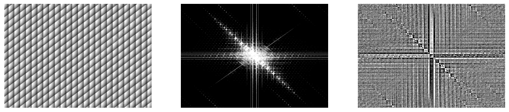
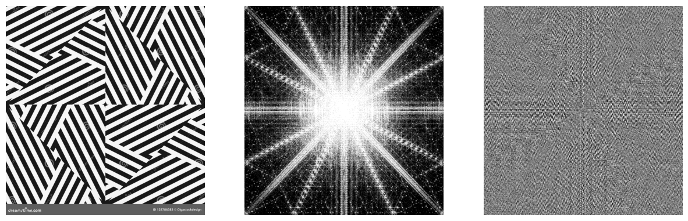

# Two-dimensional discrete fourier transform

Images as 2D signals can be analysed not only in pixel coordinates, but also in the fourier domain of wave vectors. The project shows how to apply, interpret and visualize 2D fourier transform. Some applications as image decimation and low-pass filtering are considered.

 

1. The original image and its spectrum, i.e. absolute value of fourier coefficients are shown below. For visualization purposes the log(1 + abs(fourier_coef_i)) actually is plotted with binary thresholding.

2. Ideal LP filter vs Gaussian LP \
The example of the wave vector cutting in fourier domain (ideal LP filter) and corresponding gaussian filter are illustrated below. The standard deviation (sigma) parameter for gaussian filter was chosen in such a way, that it will suppress the similar wave vector region as the ideal LP filter.

3. Wave vector aliasing in image decimation ([Moire pattern](https://en.wikipedia.org/wiki/Moir%C3%A9_pattern)) \
Before decimating the image it's advised to pass it through any low-pass filter (e.g. you can use any from the 1 step) to avoid Moire pattern on the resulting image. In the following example the original image was decimated by a factor of 4. The resulting Moire pattern is shown on the left, and the decimation result after low-pass filtering is on  the right. The cutoff wave vector for LP filter was chosen as k_s/d,  where k_s is the [Nyquist](https://en.wikipedia.org/wiki/Nyquist_frequency) wave vector and d is the decimation factor. 

4. 2D Fourier Transform for different patterns. \
To develop the intuition for Fourier transform, a few different patterns were considered and the results are visualized in the following way: the leftmost image is the original pattern, the middle one is the log(1 + fourier_coef_i) and the right image is the phase.

NB: From the results above we can see that the dominant wave vector direction in fourier domain is perpendicular to the regular line pattern in original image domain. This property can be used, for example, in optical character recognition (OCR) pipelines to determine the direction of the text.

