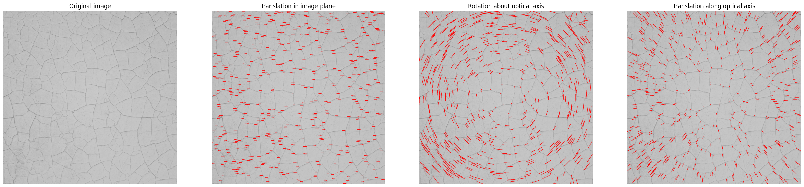
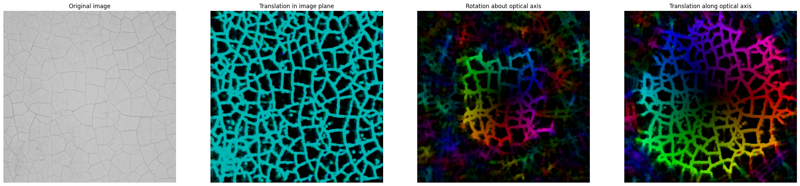
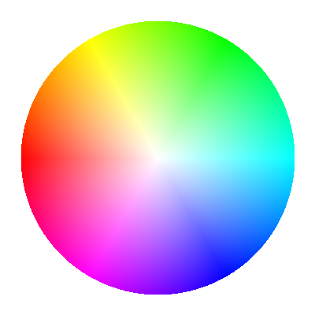

# Optical flow demonstration

 

Visualization of the sparse ([Lucas-Kanade](https://en.wikipedia.org/wiki/Lucas%E2%80%93Kanade_method)) and dense ([Gunnar Farneback](https://www.researchgate.net/publication/225138825_Two-Frame_Motion_Estimation_Based_on_Polynomial_Expansion)) optical  flow on synthetic data generated in Blender.

1. Lucas-Kanade sparse optical flow.

2. Gunnar Farneback dense optical flow.

 

NB: The HSV's hue encodes pixel motion direction according to HSV wheel:

