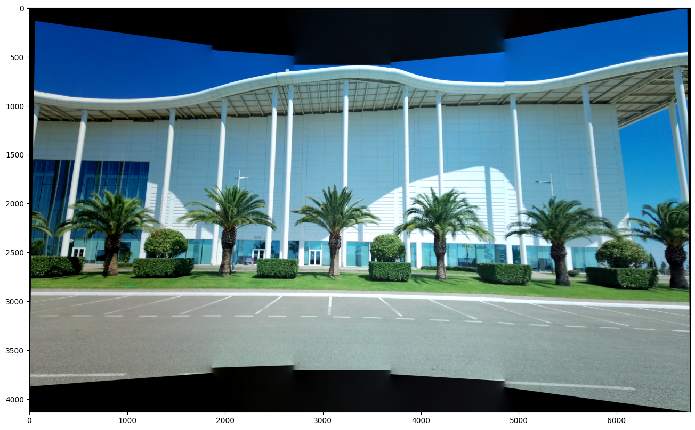

# Panorama stitching (frames are taken via pure camera rotation)

 

The implementation of panorama stitching algorithm in this repository allows to choose different center image for a panorama and also to adjust positions of the seams for more pleasant visual result. Moreover, the problem of varying frame brightness is dealt with by [Laplacian blend](https://docs.opencv.org/4.x/dc/dff/tutorial_py_pyramids.html). The frame distortions due to planar picture plane are addressed with projection on the surface of a cylinder. The _Data_ folder containes the frames used in the algorithm description below. 

More detailed description of the algorithm:

1. The [homography](https://en.wikipedia.org/wiki/Homography_(computer_vision)) matrices between neighboring frames are precomputed based on estimated corresponding points found by SIFT. The quality of a point matches is estimated via [ratio test](https://docs.opencv.org/4.x/dc/dc3/tutorial_py_matcher.html).

 

2. The frame which will serve as a common coordinate system (center image) is chosen and then all homographies to it are calculated based on the precomputed homography matrices from the 1 step.  
3. To transform all frames to the coordinate system of the center image the function `cv2.warpPerspective()` is used, the function takes as the input parameter the homography matrices from the step 2. 
4. The panorama stitching is performed as follows: the size of the resulting panorama is calculated and then the frames placed next to each other with one of the blending methods (alpha blend and laplacian blend), the position of the seams can be changed by the user input based on visual appeal.

The example of panorama stitching with rightmost frame as a center image and alpha blend:

The panorama stitching with middle frame as the center image and alpha blend (leftmost frame is too bright, see Laplacian blend below for the solution of this problem):

NB1: The Laplacian blend results in more homogeneous brightness among frames, than the alpha blend (compare it with the result of alpha blend presented on the previous image).

NB2: The distortion of the frames located further from the center image can be corrected with projection on the cylindrical picture plane, the OpenCV `cv2.remap()` function is used for that purpose. \
Example of exaggerated projection on the cylinder with small radius:

The cylinder radius can be tuned based on the best visual result (e.g. the curb on the picture must be a straight line)

