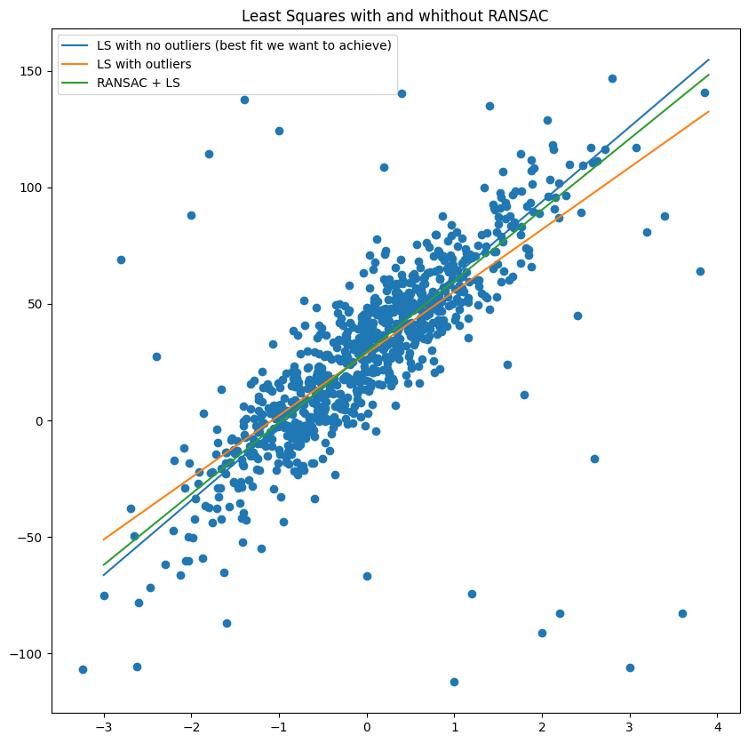

# Simple implementation of RANSAC + Least Square algorithm

 

1. The synthetic data with gaussian noise were generated and least square estimator (LSE) was fitted to the data ().
2. The outliers were generated uniformly and then LSE was fitted again.
3. LSE + RANSAC algorithm was applied to the data with outliers.

The results of the 3 fits are presented below, from where it can be seen that LSE+RANSAC is closer to the LSE on the initial data without outliers.

