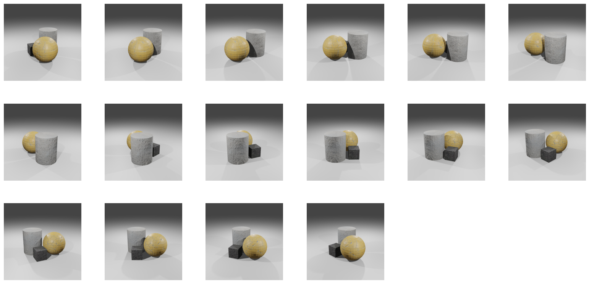
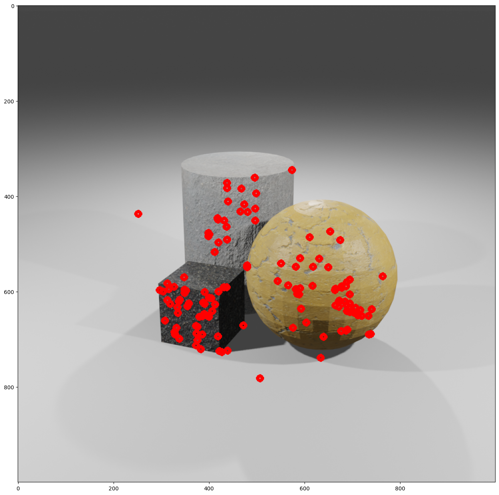
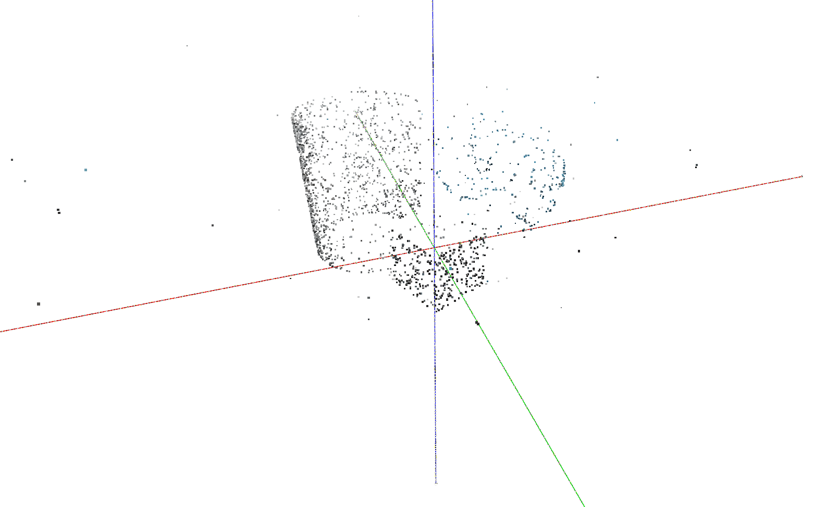
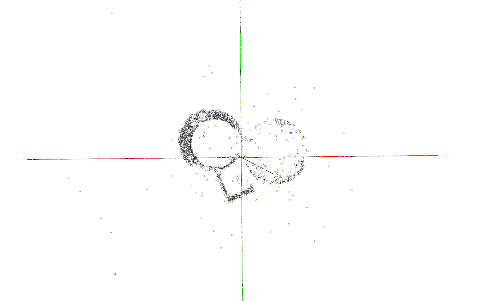

# Sparse point cloud reconstruction
The project shows an approach to reconstruct a sparse point cloud of a scene from different camera views. The similar problem can arise in such applications as structure from motion, SLAM, visual odometry, etc.  To obtain the images, the camera moves around a circle among 16 uniformly distributed positions on the Blender scene. All the intrinsic and extrinsic parameters for each position are known. 

 

1. Input data consists of 16 images from the different camera positions:

2. To find corresponding points between two neighboring camera positions the SIFT algorithm is used, and then the ratio test is applied for accessing the quality of the match. To find world coordinates of the points `cv2.triangulatePoints()`function is used.

3. All the triangulated points from 16 image pairs are added to the same point cloud. 

Sparse point cloud side view:

Sparse point cloud top view:

NB1: We didn't consider the case that the same object point might come from the different image pairs, so some cloud point filtering can be applied to improve the results.

NB2: It might be beneficial for accuracy to estimate object point position in the world frame by considering 3 and not 2 neighboring frames. 

