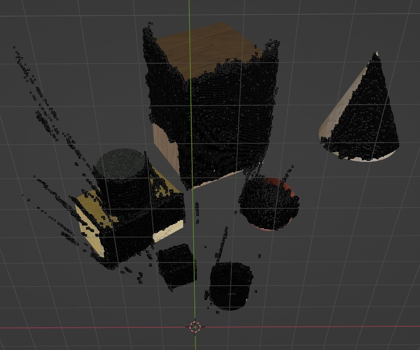

# Stereopair depth map estimation

 

Estimation of depth is an important topic in computer vision. It can be used for various applications such as robotics, 3D reconstruction. structure from motion, visual odometry. Depth can be estimated for each image pixel, in which case it's called dense map, or for a set of corresponding points, which is called a sparse map. In this project the dense map is of interest.
The scene and stereopair are modelled in Blender, such that all the intrinsic and extrinsic stereopair parameters are known, so there is no need in stereo calibration, which usually can be performed with `cv2.stereoCalibrate()` function. The textures are applied to the solids on the scene to ensure a greater amount of corresponding points. The project follows the following conventions: 
the world frame is attached to the left camera, intrinsic matrix K is assumed the same for both cameras and no lens distortion present. The cases of perfectly aligned stereopair and slightly oblique one are considered.

**Perfectly aligned stereopair**
1. Disparity map is found from two input images for the perfect stereopair using `cv2.StereoBM` algorithm. It must be emphasized that no knowledge of the intrinsic or extrinsic camera parameters is required for this step.

2. The actual distance from the left camera frame, that is a depth map, can be found only with calibrated stereopair, which means the intrinsic matrix (K) and the translation vector (t) between the cameras are known. In the following case, the objects on the Blender scene are placed at the distances between 2 and 12 meters. In order to separate the background from the objects, the points with disparity values lesser than the chosen threshold are discarded. On the following plot the vertical axis is measured in meters and the horizontal axis corresponds to the ordered pixels (points) in distance ascending order.

3. Based on disparity map and having a calibrated stereopair, it's possible to reconstruct scene as 3D point cloud by triangulation from disparity map with the help of the function `cv2.reprojectImageTo3D()`. The color information is also preserved for each triangulated point. The [MeshLab](https://www.meshlab.net/) is used for visualization of a cloud point. 

Visualization of the point cloud overlaid on the solids from the Blender scene:

    
**Oblique stereopair**

In order to find dense disparity/depth map, the frames obtained from the stereopair must be rectified, i.e. transformed in a such way as if they were taken by a perfect stereopair. The main advantage of rectified frames for finding disparity/depth map is that the epipolar lines will become horizontal, and all the corresponding points in both frames will be located on those horizontal lines, so the search for them becomes conceptually and computationally easier.
The algorithm looks as follows:
1. The key points between two frames are found with `cv2.goodFeaturesToTrack()` performed on the left image, and then optical flow for these points calculated with `cv2.calcOpticalFlowPyrLK()` to find corresponding points on the right image.

2. Using corresponding points the fundamental matrix F is found with `cv2.findFundamentalMat()`. A few epipolar lines for oblique stereopair images are visualised below:

3. The small rotations which have to be applied to both cameras in order to make oblique stereopair a perfect one can be found with `cv2.stereoRectify()`, which takes as arguments intrinsics and extrinsics parameters of the stereopair found after stereo calibration. 

4. Leveraging the knowledge of small rotations from teh step 3, the rectified frames can be found in two ways: either by directly constructing two homography matrices to transform the left and right image with `cv2.warpPerspective()`, or by the means of `cv2.initUndistortRectifyMap()` , which returns maps that can be applied to the images with `cv2.remap()`. The result is rectified frames with the parallel epipolar lines:

5. Having rectified images, we can follow the first algorithm for the perfect stereopair to find disparity/depth map.

NB1: `cv2.stereoRectifyUncalibrated()` can be used in case of uncalibrated stereopair for the tasks where absolute values of distance are not that important.

NB2: If the depth estimation for a small set of key points is of interest, it's not necessary to rectify the images as the depths can be found just by the use of the known after stereo calibration intrinsic and extrinsic parameters of a stereopair. 
